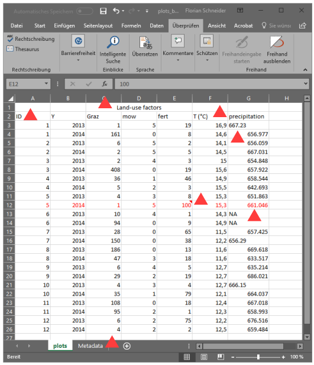
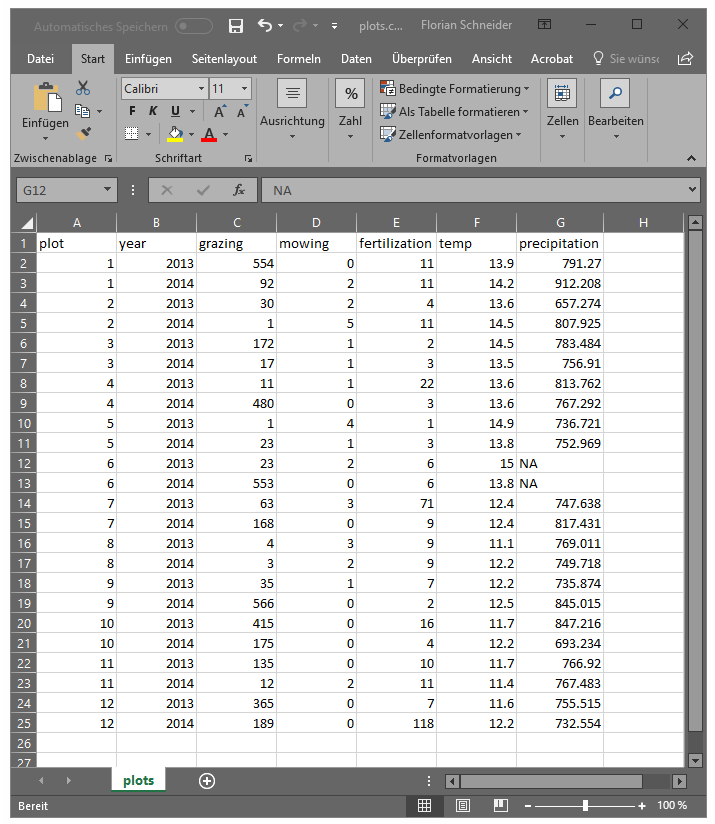
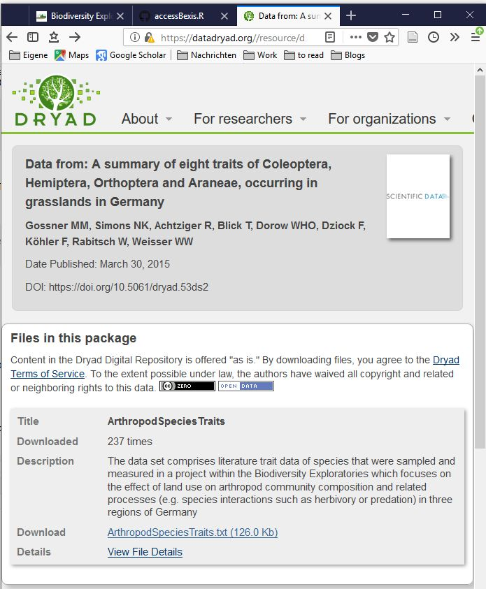
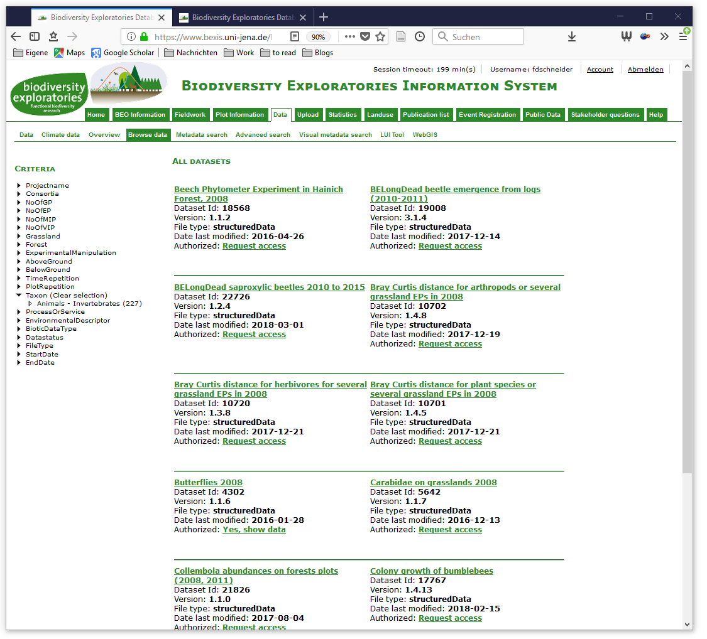

```{r setup, include=FALSE}
knitr::opts_chunk$set(comment = NA)
```

# Preface

This workshop covers basic and advanced data handling in R. 

We will talk about how to

- prepare raw data for R
- read data into R and write file output from R
- selectively access columns and rows
- fix errors in your data, deal with missing data etc.
- review your data (getting summaries etc.)
- add columns or covariates

and more advanced: 

- convert data structure using tidy and dplyr
- prepare data for publication 


## Preparations

The commands and examples are tested for R > v3.0! Please run the follwing command to ensure that you have all required packages installed: 

```{r, eval = FALSE}
install.packages(c("getPass", "RCurl", "XML", "dplyr", "tidyr", "ggplot2", "reshape2"))
```

```{r load packages, message=FALSE, warning=FALSE, include=FALSE}
require("getPass")
require("dplyr"); require("tidyr"); require("ggplot2")
```

Also, a suite of online scripts and data will be required. Please run this block to make them available: 

```{r message=FALSE, warning=FALSE}
source("https://gist.githubusercontent.com/fdschneider/9f5d044d5091976741ad07dab5439a77/raw/faed4eca5ed142797e3c9431029d02c8d46d39dc/accessBexis.R")

```


This lesson assumes basic knowledge in R, like

- how to do calculations
- how to assign objects and differences of object types (vector, data.frame)
- basic understanding of functions (how to apply a function, apply parameters)
- how to get help about a function (`?` and manpages)
- how to read data tables into R 
- how to pick a subset of rows and columns from your table

If you don't feel comfortable with these topics, please walk through this basic script before the workshop: 
http://fdschneider.de/r_basics/ 

## Online reference

The presentation script and exercise can be found at http://fdschneider.de/r_datahandling/!

Please report difficulties or errors on my Github page: https://github.com/fdschneider/r_datahandling/issues. 

<a rel="license" href="http://creativecommons.org/licenses/by/4.0/"></a><br /><span xmlns:dct="http://purl.org/dc/terms/" href="http://purl.org/dc/dcmitype/Text" property="dct:title" rel="dct:type">R data handling script</span> by <span xmlns:cc="http://creativecommons.org/ns#" property="cc:attributionName">Florian D. Schneider</span> is licensed under a <a rel="license" href="http://creativecommons.org/licenses/by/4.0/">Creative Commons Attribution 4.0 International License</a>.


---


# 1. prepare your data for R: raw-data structure 

Usually, the dataset you want to use was assessed in the experimental environment in the field, or in a laboratory. Either via direct input or via a paper notebook, the data ended up in some spreadsheet software, mostly MS Excel or Libre Office Calc. 

## data structure

Of course, R will be able to read in data tables of any structure. Any data structure can be transferred with a couple of lines of code into any form you require. But you can simplify your life if you decide on a **raw data structure** that is easy to handle in R. To achieve this, there are a couple of rules of thumb: 

- **one line = one data point**:  Long-table formats are more tidy than wide-tables (Whickham 2014), e.g. if you keep replicated measures in own columns it is much more work to tell R why they are basically the same, but different. Rather add another column to label treatments or replicates. 
- **keep measured raw data seperate from transformed or derived data**: Raw data are sacred! Maintain a static version of the original raw  data and use R to create derived metrics (e.g. means of replicates) or estimates to fill gaps. 
- **Provide documentation**: for instance keep a README or METADATA file along with your data file to describe all column names and variables, define units and measurement procedures. 
- **save in .csv or .txt format**, not .xlsx; mind internationalization settings, i.e. comma separated cells, point decimal delimiter, and ASCII or UTF file encoding. This will ensure your file is accessible in the future. Note that Microsoft Excel by default uses comma decimal separator and semi-colon `;` separators between columns and decimal commas  if your system language is German!


**Never** 

- **merge cells**: That is a spreadsheet feature completely meaningless in R.  
- **rely on cell formatting** to make your file informative, e.g. colored cells or bold font. This information is lost when opening the file in R.   
- **keep empty lines**: make sure to eliminate blank space (rows or columns). (missing data values are okay!)

 

## header

Ideally, your raw-data file will have precisely one header row (not two rows, no empty rows!), that contains column names. 

The **column names** should  

- **be unique** within the table
- **be unambiguous** and easy to remember 
- use either only lower case *or* only upper case letters
- not contain spaces or points or special characters, except `_`.

I recommend that you use **english column names** from the start. That makes it easier to publish or share your data. 



## values

Keep in mind that there are different types of values which come with different implications for computation (and file size):

- **numerical values**: these are usually continuous float numbers, with a certain amount of decimal places (e.g. "0.00032", "13", or "240000"). They may also be discrete integer values (which is a fundamental difference when it comes to statistics and plotting).
- **categorical/factorial values**: these are character strings from a defined vocabulary of ordered or unordered factor levels, like  sometimes you use own codes (e.g. "a, b, c", or "aew, hew, sew", or treatment levels like "low", "medium", "high"). Make sure those are harmonized throughout the raw-data file (e.g. don't mix "Yes" and "yes" values!)!  A special case of factorial values are binaries (e.g. "TRUE"/"FALSE" or "Y"/"N" or "0"/"1") 
- **missing values**: there is no clear convention. Often those are labelled "NA" for true missing values, or just empty "" if the value does not apply to the data set. Some authors use clear markers which can easily be filtered, like "999".  
All this helps to keep your data files simple and unambiguous and forces you to use a clear structure. Ideally, the data file is static and not used for calculations. All calculations and transformations of your data are done in R!
- **weird values**: like date & time, geolocation, DOIs & URLs. These require particular packages and functions for handling in R. Make sure to document their meaning and format in the README file. 

Some columns may contain comments or warnings, specific explanations etc. In R these are considered as character strings (e.g. "Data missing because of bad weather conditions.") and are not exactly used for data analysis. 

---

# 2. Read raw data 

R can read data tables of many file formats but the most basic file format are pure text files (.csv, .txt), where columns are separated by line breaks and rows are separated by a 'Separator', which is usually a comma (hence .csv = **c**omma **s**eparated **v**alue). 

We cover two-dimensional spradsheet files here, which in R are handled in 'data.frame' objects. More complex file formats like relational databases are beyond this tutorial. 

## read function

To open a file in R you will need one of the following functions.

```{r, eval = FALSE}
rawdata <- read.table("rawdata.txt") 
rawdata <- read.csv2("rawdata.csv")
rawdata <- read.csv("rawdata.csv")  
rawdata <- read.delim("rawdata.tab") 
```

These are alternative functions that do mostly the same, but have different default assumptions of the data structure of your text-file "table.csv". For instance `read.csv2()` assumes `;` as field separator and comma `,` as decimal separator, as for files generated in Office with German language settings. The function parameters allow you to set the separator (`sep`) and decimal delimiter (`del`), to skip a leading line (`skip`) or to expect a header (`header`). The argument `na.strings` takes a vector of character strings that are to be taken as missing values. So, if your file does not read well into R, it's likely you have to meddle with these parameters (see `?read.table` for further information). 

For other file formats you might require additional packages. Most notable are: 

- `readxl` package for files created with MS Excel: provides the functions `read_xls()` and `read_xlsx()`. 
- `foreign` package allows you to read data tables exported from other statistical software like SPSS, SAS, Octave (see [this comment](https://cran.r-project.org/doc/manuals/R-data.html#Importing-from-other-statistical-systems)).

## working directory

Importing data probably does not work right away. The R environment typically assumes your home directory as the working environment. Since you refer to a file outside of R, you need to tell R which place you are referring to by specifying the path to that file. There are two ways of doing this.  

1. giving an absolute path for the file
```{r, eval= FALSE}
  d1 <- read.table("C:/Windows/Users/florian.schneider/Documents/projects/stats/r_datsahandling/data/12807/12807.txt")
```
  This can be very long, and will not work, if you switch to a different computer or share the file with colleagues. 
  
2. setting the working directory for R prior to loading the file and call a relative path for the file
```{r, eval = FALSE}
  setwd("G:/uni/projects/stats/r_datahandling/")
  d1 <- read.table("data/12807/12807.txt", header = TRUE, sep = "\t")
```
```{r, echo = FALSE}
  d1 <- read.table("data/12807/12807.txt", sep = "\t", header  = TRUE )
  d2 <- read.table("data/13426/13426.txt", sep = "\t", header  = TRUE )

```

**Advanced Note:** The simplest way to manage working directories and relative paths is to use RStudio projects. For each project, RStudio will assume the working directory in the project root directory. If you open the project on a different computer or move it around on your computer, R will still find the relative paths. 

## reading a file from the internet 

Instead of reading files from your local computer, you may want to refer to files published online, e.g. on Github or figshare. 
In principle, you can open any text-based file (csv or txt) that is accessible online as a download. Just enter the download link (usually what you get when right-clicking on the link and select "copy link") as source path. 

 

```{r}
traits <- read.table("https://datadryad.org/bitstream/handle/10255/dryad.76638/ArthropodSpeciesTraits.txt?sequence=1", 
                     sep = "\t", header = TRUE) # original publication DOI: 10.1038/sdata.2015.13 metadata: https://www.nature.com/articles/sdata201513/tables/2


```

**Advanced Tip**:  Very often, data packages are compiled into compressed zip-archives. In this case, R can download and extract files by name. This little script allows you to do this. The example accesses data from this publication from the Biodiversity Exploratories: 

> Völler, Eva; Bossdorf, Oliver; Prati, Daniel; Auge, Harald (2017): Quantitative genetic traits of eight grassland species from three regions of Germany (Schwäbische Alb, Hainich-Dün, Schorfheide Chorin). PANGAEA, https://doi.org/10.1594/PANGAEA.871061 

```{r}
temp <- tempfile(fileext = ".zip")
download.file("https://doi.pangaea.de/10.1594/PANGAEA.871061?format=zip", temp, method = "auto", quiet = TRUE, mode="wb")
unzip(temp, files = "datasets/Voeller_F-rubra.tab", exdir = "data", junkpaths = TRUE )  # parameters give relative path of file within the archive and where to extract to
unlink(temp)
rm(temp)

F_rubra <- read.delim("data/Voeller_F-rubra.tab", skip = 19, encoding = "UTF-8")

```

## reading a file from BExIS

BExIS (https://www.bexis.uni-jena.de/) is the central data management platform for the Biodiversity Exploratories. You are supposed to upload your own project data here and you have access to descriptive parameters of the plots and many other project datasets. 



An R script by Dennis Heimann and Andreas Ostrowski provides the function `read_service()` (original version as BExIS ID 6080, modified by myself with interactive password prompt [from this link](https://gist.github.com/fdschneider/9f5d044d5091976741ad07dab5439a77)).

Note that you need BExIS access credentials to call this function as well as permission to download the file from the data owner (request management is done via BExIS). The function takes a BExIS ID, your personal credentials (`user` and `pswd`) as well as the typical parameters required for `read.table()` (i.e. `sep`, `dec`).

```{r, eval = FALSE}
LUI_factors <- read.service(19266, dec = ",", user = "yourname", pswd = "yourpassword")

```

```{r echo=FALSE, message=FALSE, warning=FALSE}
LUI_factors <- read.service(19266, dec = ",", user = "fdschneider")

```

A couple of shared core datasets that might be useful for your analysis: 

-  20826: Basic Information of all Experimental Plots (EPs)
-  20907: Coordinates and Inventory Overview of all Grid Plots (GPs)
-  19007: Climate data - Time Series Web Interface
-  20055: Forest EP - forest management
-  19266: Input LUI Calculation Tool (contains all LUI single factors)

For some of these, you may need to ask for permission by the data owner. By downloading files from BExIS you declare consent with the data sharing agreement of the Exploratories!

## reading multiple files at once

If you work with large bits of data, your raw data might be split across separate files or spreadsheet pages. To load them in a single call you may use a loop. In the following example, we call all files from a specific directory (called "data"):

```{r, eval = FALSE}
files <- dir("data")
filenames <- sub( ".csv", "", files)
for (i in 1:length(files)) assign(filenames[i], read.csv(files[i]))
```

This requires however, that the data are of the same structure, i.e. they use same delimiters and separators etc!

In the example above, using an extended code  will read all files that are included in the zip archive: 

```{r}
temp <- tempfile(fileext = ".zip")
download.file("https://doi.pangaea.de/10.1594/PANGAEA.871061?format=zip", temp, method = "auto", quiet = TRUE, mode="wb")
unzip(temp, exdir = "data")  # parameters give relative path of file within the archive and where to extract to
unlink(temp)
rm(temp)

library(data.table)

files <- dir("data/datasets")
filenames <- sub( ".tab", "", files)
voeller <- list()

for (i in 1:length(files)) {
  file <- paste0("data/datasets/",files[i])
  temp <- readLines(file)    # temporary content of file
  skipLine <- which(temp == "*/")  #this is a dirty solution to finding the end of the comment section in each file
  voeller[[i]] <- read.delim(file, skip = skipLine, encoding = "UTF-8") # the data.table format of package data.table is more flexible when merging
}

voeller <- rbindlist(voeller, fill = TRUE )

voeller
```


## write data

Just to complete this section, we cover writing data files that have been created in R to your disk. 
Any data.frame object can be written into a text file using `write.csv()` and `write.table()` (just analog to `read.csv()` and `read.table()`). 

```{r}
write.csv(LUI_factors, file = "data/processed/LUI_factors.csv", fileEncoding = "UTF-8" )
write.csv(voeller, file = "data/processed/voeller.csv", fileEncoding = "UTF-8" )
```

Saving output after certain steps of computation can be useful to avoid repeating computation-heavy steps during your data processing. Just save the compiled data, means, or intermediate statistics in script 1 and build on top of this in script 2. 

**A note on file encoding:** There are an infinite number of standards for text file encodings, i.e. the mappings of bits and bytes to actual letters. The UTF-8 standard is the most universal and accepted encoding. If you want to publish your data on a repository, it is recommended to choose this mode. If you want to learn more about encodings, start with [this Wikipedia article](https://en.wikipedia.org/wiki/Character_encoding) and check out `?file`. 

---

# 3. Review your data object

Now you have the content of the file available in R as an object, more specifically as a 'data.frame'.

## about data.frames

Dataframes are two-dimensional tabular structures. They can easily be accessed by column and row. Usually the columns are named by a column header, and the rows are numbered. 

In most cases, tables can be interpreted as **observations** (the rows) on a fixed number of **variables** (the columns). Each observation contains a set of defined metrics, one for each variable of interest. In ecological data, variables can usually be further distinguished into response variables and descriptive explanatory variables or cofactors. Explanatory variables also comprise information about the spatio-temporal context of the measurement (e.g. the plot or year). 

Technically, each column is a vector of the same length (= number of rows), while each vector can have different content type, i.e. numbers, factorials, characters. This is the main difference with matrices, which are homogeneous in content. In contrast, list objects may have different vector lengths for each entry. 
The most direct way to access a column in a data frame is the `$` sign:

```{r}
hist(LUI_factors$TotalGrazing)
```

We cover alternative ways of accessing data further below. 

## review structure

You can have a look at how the data are structured using the functions `str()` or `head()` 

```{r}
str(LUI_factors)  # returns the type of data for each column of the table 
```

This shows you the overall dimensions of the table, as well as the column name, type of values and number of factor levels for each colum. You see that R recognised numerical, integer and factorial columns. We'll discuss how and if this is a correct interpretation below.

```{r} 
head(LUI_factors) 
```
This returns the first 6 rows of a dataframe by default, and is ideal for scanning the structure of the data if the tables are not too wide. 

For a more detailled summary, you may call

```{r} 
summary(LUI_factors) 
```

If applied to a data.frame, this function produces basic stats for each column, like means and quantiles of numerical values, and frequencies of factor levels. Obviously, these statistics are not always meaningful, e.g. in case of Year. 

Further convenient functions for data.frames are 

- `names()` : which gives you a vector of the column names
- `dim()` : which gives you the number of rows and columns of your data.frame

## fixing problems in data.frames

When reading data from a file, R 'guesses' the data type from the values it finds within a column. Often, this is not precisely what you want and you need to correct data types. Also, sometimes R needs further input to interpret variable values correctly.  

**A quick recap of data types in R**: There are different types of data  that R can handle. The following objects do have different specifications. 

```{r}
 x <- c(3.2323, 4.5723, 3.8356, 8.2301, 4.4285)
     str(x)
 v <- 1:6
     str(v)
 b <- c(FALSE, TRUE, FALSE, FALSE)
     str(b)
 n <- c("Agriphila_tristella", "Agriphila_tristella", "Idaea_aversata", "Agriphila_straminella", "Chiasmia_clathrata")
     str(n)
 f <- as.factor(c("A", "A", "B", "C", "A", "B", "B", "C", "C"))
     str(f)
```

This becomes very important e.g. for statistical modelling, since the types prompt different kinds of analysis or plotting. The  types also require different amount of space in the computer memory.^[Objects that contain data of mixed types will be coerced into the more flexible type. e.g. a vector `c("a", 1)` will be of type `"character"`.] 

It is useful to understand that for modelling purposes and computationally intensive tasks. 

data type  | usage                                          | bits  per value 
---------- | ---------------------------------------------- | ------------------
"double"   | for non-integer, float numbers, percentages etc. |  32
"integer"  | for count data, for factorial data             | 3 - 32
"logical"  | for boolean TRUE/FALSE values, for binary data (e.g. survival) | 1
"character" | for strings of characters, written information, non-repeating words | many thousand, 8 per character
"factor"   | categorical values, like experimental blocks, treatments, etc. ; technically not a type, but a class, but never mind (stored as integer numbers, encoded as factor levels) | 3 - 32

**Advanced R:** The package `readr` provides an improved function for guessing the types of in heterogeneous data. It does a much better job interpreting logical and numerical values, or date and currency vectors. The output 

### fixing the data type

It is quite common that integer numbers are interpreted as integer, but it would be more useful to consider them as categorical, e.g. in the case of years. The order of the years is not important in the first place (seasons are highly variable) and if the timeseries misses a year, that doesn't mean that gap is interpreted as a double distance of data points.

```{r}
str(LUI_factors$Year)
LUI_factors$Year <- as.factor(LUI_factors$Year)
str(LUI_factors$Year)
```

Note that this is indeed a re-assignment (using the assignment arrow `<-`), that overwrites the old variable 'Year' with the new, corrected vector! We will use this throughout the next couple of examples. 

Alternatively, you might want years be encoded as date. Date and time handling in R is a tricky task and not covered in depth here. But for a start, check out the manual for the `as.Date()` function, as well as the format coding described under `?strptime`. 

```{r}
str(d1$date)
d1$date <- as.Date(d1$date, format = "%m/%d/%Y %I:%M:%S %p")
str(d1$date)
```


### harmonize factor levels

In factorial/categorical variables, the factor levels must be coherent, otherwise R will interprete them as two or more independent levels. This is a dangerous error that often goes unnoticed in big datasets. Start with checking out the levels of your factorial variables.

```{r}
levels(d1$plant_genus) # shows the vector of levels found in your data
subset(d1, plant_genus %in% c("Alchemilla", "Achemilla"))
```
Obviously, the genus "Achemilla" does not exist. Its a typo of 'Alchemilla'. What we need is to reunite the factor level 'Achemilla' with 'Alchemilla'. The graceful solution requires `revalue` from package `plyr`: 

```{r, message=FALSE}
require(plyr)
d1$plant_genus <- revalue(d1$plant_genus, replace = c(Achemilla = "Alchemilla"))

```

**Advanced tip: **  such errors sometimes are not just typos but result of lacking standardization: Especially with taxonomic names, you will need to figure out synonyms. The package `taxize` helps to look up taxon names on online webservices and map them to their accepted taxon name. 

### Change order of factor levels

By default, the factor levels are ordered alphabetically. E.g. 

```{r}
head(traits$Stratum_use_short)
```

Here, `g` stands for ground-dweller, `h` for herb layer, `s` for soil-dweller, `t` for shrub & tree layer, `u` for unspecific and `w` for water-bound. For a meaningful interpretation of the vertical stratum, a ecologically informed re-assignment of the order might be useful. 

```{r}
traits$Stratum_use_short <- factor(traits$Stratum_use_short, levels = c("s", "g", "h", "t", "w", "u"))
head(traits$Stratum_use_short)
```

## dropping factor levels

Any factor levels of the original vector or dataframe will be preserved if you use `[]` or `subset()`. If you want to eliminate unused factor levels you should apply the function `droplevels()`, e.g. if you want to plot figures from the data that are based on the factor levels:

```{r}
f
f[f != "A"]
droplevels(f[f != "A"])

```

### Fix logical vectors

Most common is the case where logical values are encoded in user-defined terms, like 'yes'/'no' or '1'/'0'. Only if levels are encoded in the file as one out of c("T", "TRUE", "True", "true") or c("F", "FALSE", "False", "false") then R assumes they are logical. Pure integer vectors of 1 and 0 are also interpreted as TRUE and FALSE in a logical vector. In any other case, you need to translate your own encoding. 
To fix this, we first need to replace the labels, and then convert it to a logical vector. 

```{r}
str(LUI_factors$isVIP)
LUI_factors$isVIP <- factor(LUI_factors$isVIP, levels = c("yes", "no"), labels = c(TRUE, FALSE)) # here, levels lists the order of the old labels, and labels the names of the new labels. 
LUI_factors$isVIP <- as.logical(LUI_factors$isVIP) # as.logical is able to interpret 
str(LUI_factors$isVIP)
```

### fixing column names

Sometimes a downstream code or function expects a column to have a certain name, or you want to fix a typo in the original column header. The function `names()` allows you to access and edit the column names of a data frame.

```{r}
names(traits)[4] <- "species"

```

### deleting and selecting columns 

You may want to keep your data table tidy and strip all columns that are not needed for your analysis. There are a couple of ways of deleting unwanted columns (negative subsetting).

```{r}
# replacing the original table with one that is reduced by the unwanted column (negative subsetting)
traits <- subset(traits, select = c(-Endophagous_lifestyle))

# eliminating the column by setting it to value NULL
traits$Stratum_use <- NULL

```

alternatively, select the columns you want to keep (positive subsetting): 

```{r}
traits_tidy <- subset(traits, select = c(species, Body_Size, Feeding_guild_short, Stratum_use_short))
head(traits_tidy)
```

This obviously can also be used to re-order columns in your data frame. 

### eliminating unwanted rows

Sometimes, some entries in your dataset are flagged as invalid or flawed, or just are empty rows. In those cases, delete them before you start doing any analysis. 

```{r, eval = FALSE}
d1 <- subset(d1, plant_species != "") # deletes any rows with empty entries in column plant_species
```

In the traits data, a `*` in column `Remark` flags species that do neither obligatory nor facultative occur in grasslands. Let's say, we want to skip those. 

```{r}
traits <- subset(traits, Remark != "*")
```

We go more into depth for selecting rows and columns in the next section of the workshop. 


---

Before you do any calculations with your raw-data, you should make sure that the R-object correctly reflects the structure of your data. It is recommended to keep a script of these steps that allows you to re-run the corrections any time you change your data.

## Exercise 1 {.exercise}

We are using data from the open data section of the Biodiversity Exploratories (https://www.bexis.uni-jena.de/PublicData/BrowsePublicData.aspx). 

- dataset: 12807 - InsectScale - Flower Cover (2009)
  metadata page: https://www.bexis.uni-jena.de/PublicData/ShowPublicXml.aspx?DatasetId=12807
  download page: https://www.bexis.uni-jena.de/PublicData/ShowPublicPrimaryData.aspx?DatasetId=12807
- dataset: 13426 - InsectScale2008FlowerCover
  metadata page: https://www.bexis.uni-jena.de/PublicData/ShowPublicXml.aspx?DatasetId=13426
  download page: https://www.bexis.uni-jena.de/PublicData/ShowPublicPrimaryData.aspx?DatasetId=13426
- dataset: 12967 - Simpson´s diversity of Coleoptera and Heteroptera
  metadata page: https://www.bexis.uni-jena.de/PublicData/ShowPublicXml.aspx?DatasetId=12967
  download page: https://www.bexis.uni-jena.de/PublicData/ShowPublicPrimaryData.aspx?DatasetId=12967

1. download the files, unzip and read them into R!

Advanced: 

2. fix date format 
3. rename exploratory factor levels to "SCH", "HAI", "ALB" and (in north to south order)
4. check and harmonize factor levels for genus and species
5. Save your corrected data into new files (csv format). keep them separate from your raw data. 

--- 

Solution:

```{r}
  d1 <- read.table("data/12807/12807.txt", sep = "\t", header  = TRUE )
  d2 <- read.table("data/13426/13426.txt", sep = "\t", header  = TRUE )
  d3 <- read.table("data/12967/12967.txt", sep = "\t", header  = TRUE ) 
  
  #2. 
  d1$date <- as.Date(d1$date, format = "%m/%d/%Y %I:%M:%S %p")
  d2$date <- as.Date(d2$date, format = "%m/%d/%Y %I:%M:%S %p")
  
  #3.
  d1$exploratory <- factor(d1$exploratory, levels = c("Schorfheide", "Hainich", "Alb"), labels = c("SCH","HAI", "ALB"))
    # Note that in the 2009 dataset, the Schorfheide is missing originally. This adds a third level that wasn't there before!
  d2$exploratory <- factor(d2$exploratory, levels = c("Schorfheide", "Hainich", "SchwaebischeAlb"), labels = c("SCH","HAI", "ALB"))
    # note the difference in nomenclature of Schwaebische Alb.   
  
  #4.
  d1$plant_genus <- revalue(d1$plant_genus, replace = c(Achemilla = "Alchemilla"))
     # any other synonyms found?
  
  #5. 
  if(!dir.exists("data/processed/")) dir.create("data/processed/")
    # note that any sub-folder you are writing to must exist! This line checks if it does and otherwise creates it. 
  write.csv(d1, file = "data/processed/flowers2009.csv")
  write.csv(d2, file = "data/processed/flowers2008.csv")
  write.csv(d1, file = "data/processed/diversity2008.csv")
    # you might want to add a README file in "data/processed" that explains the origin and processing for these files.
  
```

---

# 4. operations on data columns

Now, before you start analysing your data, you may have to modify some of the original raw data into derived statistics. This section covers operations that affect single columns in your data.frame.   

## renaming values 

As we have learned before, factor levels can be remapped by re-assigning it using the function `factor()`. 


revalue() 
mapvalue()

## re-coding categorical variables

```{r}
levels(traits$Stratum_use_short)
```


## mapping continuous to categorical variables

For many data analysis, you want to classify continuous variables, e.g. into high or low categories. You can do that by using fixed thresholds and the `cut()` function.

```{r}
hist(LUI_factors$TotalGrazing)
LUI_factors$Grazing_categorical <- cut(LUI_factors$TotalGrazing, breaks = c(0,100,1000,10000), labels = c("low", "normal", "high"))
plot(LUI_factors$Grazing_categorical, main = "number of plots with grazing pressure ...")
```


## convert units

In numerical variables, you sometimes want to convert units to a standard form, e.g. inch to cm (one inch is 2.54 cm).

```{r}

```


## normalize

Very often in ecology, you will have to normalize measured values to make different variables comparable. If you need to apply a normalization (i.e. all variation falls within 0 and 1) to an entire column, this is as simple as dividing the vector by its maximal value. 

```{r}
LUI_factors$Grazing_standardized <- LUI_factors$TotalGrazing / max(LUI_factors$TotalGrazing)
hist(LUI_factors$Grazing_standardized)
```

An alternative option is to standardize values around 0 while scaling all variation to get a standard deviation of 1 (that is often done before multivariate analysis). For this task we have function `scale()`

```{r}
LUI_factors$Grazing_standardized <- (LUI_factors$TotalGrazing - mean(LUI_factors$TotalGrazing)) / sd(LUI_factors$TotalGrazing) 
hist(LUI_factors$Grazing_standardized)  
```

However, often you want a standardization applied *within* a group of some other variable. For instance if you need measured values comparable between regions. For this, it is necessary to create a normalization vector that depends on the grouping variable. In basic R, this is rather tedious. The key function here is `tapply()` which applies a function to the data grouped by an index.

```{r}
tapply(LUI_factors$TotalGrazing, LUI_factors$Exploratory, max) 

max_vals <- tapply(LUI_factors$TotalGrazing, LUI_factors$Exploratory, max)[LUI_factors$Exploratory]
LUI_factors$Grazing_standardized <- LUI_factors$TotalGrazing  / max_vals
```


## transform() & mutate()

A function that helps in adding new columns to your data.frame is `transform()` and its advanced version `mutate()` of the package plyr. They allow you to specify multiple new columns or alter existing columns in one call. 

```{r}
LUI_factors <- transform(LUI_factors, 
                Grazing_standardized = LUI_factors$TotalGrazing / max(LUI_factors$TotalGrazing),
                Fertilization_standardized = LUI_factors$TotalFertilization / max(LUI_factors$TotalFertilization),
                Mowing_standardized = LUI_factors$TotalMowing / max(LUI_factors$TotalMowing)
  ) 
```

Note that you can't use the new columns for computations of other new columns. You need to run a second call of transform. The `mutate()` function adds this capacity while also being much faster (which may become important in big datasets):

```{r}
LUI_factors <- mutate(LUI_factors, 
                Grazing_standardized = LUI_factors$TotalGrazing / max(LUI_factors$TotalGrazing),
                Fertilization_standardized = LUI_factors$TotalFertilization / max(LUI_factors$TotalFertilization),
                Mowing_standardized = LUI_factors$TotalMowing / max(LUI_factors$TotalMowing),
                LUI = (Grazing_standardized + Fertilization_standardized + Mowing_standardized) / 3
  ) 
```


---


# 5. Access data 

When it comes to analysis, you need to use the content of your data.frame to do your further calculations. Most beginners guides describe `attach()` and `detach()` to access data within a table. 

```{r, eval = FALSE}

attach(traits)
plot(Dispersal_ability ~ Body_Size)
detach(traits)
```

This clutters the R environment with a lot of invisible objects. People do often forget to detach databases and then objects are difficult to handle and to remove. Also, if you modify those objects, they will not affect the master table, which remains in the state it was before it was attached. **Using `attach()` is considered bad practice!**

Rather you should access content directly. The easiest way would be to use the `$` selector. 

```{r, eval = FALSE}
lm(d3$heteroptera_simpson ~  d3$coleoptera_simpson)
```

or, if you will need to access data many times, it is more convenient to extract what you need into a shorthand object. 

```{r, eval = FALSE}
y <- LUI_factors$Year
grazing <- LUI_factors$TotalGrazing
lm(grazing ~ y)
```


**Best practice!**: Keep the table structure of your data object intact and tell the functions were to find the columns using the `data` parameter, which is available in many statistical functions and plotting functions:

```{r, eval = FALSE}
lm(TotalMowing ~ TotalFertilization + Exploratory, data = LUI_factors)
```


**Advanced:** You could also use the function `with()` which creates a temporary environment where the content of your data table is available:

```{r, eval = FALSE}
with(d3, lm(heteroptera_richness ~ coleoptera_richness))
```

The `with()` function is very powerful since it allows you to execute any other function, even very complex calls, on a data.frame. 

## select columns and rows

A very powerful function are the squared brackets  `[]` which allow you to select columns by name or by position and let you create a subset of columns.

```{r}
head(LUI_factors[,c("Year","EP_PlotID", "TotalGrazing")])
```

In complex data sets, you often want to exclude part of it before you go on with your analysis or plot only a subset based on a condition, e.g. to show the data of only one treatment and not the other.

The squared brackets `[]` can also be used to select rows of a vector or a data frame.

To exclude one row of data, e.g. because you know that the replicate was methodologically flawed or an extreme outlier, the simplest way is to do 

```{r, eval = FALSE}
LUI_factors[23:25,]
```

Or you might want to exclude a sequence of data (negative subsetting). 

```{r, eval = FALSE}
data1 <- rawdata[-c(42:64),]
```

Thus, the first selector within `[]` defines the rows, the second defines the columns!  This allows us to create very compact data extracts. 

```{r}
  s1 <- d1[d1$plant_species %in% c("Plantago lanceolata") , c("inflorescences_qcm","date")]
  head(s1)
  s2 <- d1[d1$EP_PlotID %in% c("HEG24"), c("plant_species","inflorescences_qcm", "date")]
  head(s2)
```


## using logical expressions
 
In most cases, the rows you want to exclude are loosely mixed into your dataset and you want to select rows by a condition. Conditionals are based on  'logical expressions', a concept that is common to all programming languages:

- `A == B` : A equals B 
- `A != B` : A is unequal to B
- `A < B`, `A > B` : A is less than B, A is greater than B
- `A <= B`, `A >= B` : A is less than or equal to B, A is greater than or equal to B
- `A %in% B` : The value in A is contained in vector B

Thus, if A and B are numerical values, the expression returns logical values: `TRUE` or `FALSE`. If the logical operator is comparing a value and a vector, it returns a **logical vector**!

```{r}
1:12 > 6
f <- rep(c("A","B", "C"), each = 3); f
f == "A"
6 %in% 1:5 
c("SCH", "HAI", "ALB") %in% c("HAI") 
```

These logical vectors can be used to select rows from a data table. 

```{r}
# create an example data.frame 
d <- data.frame(plot = f, y = c(1,1,1.4,1.2,1.3,1.2,1.4,1.2,1.1))

d
d[d$x == "C",]
d[d$y >= 1.3,]
```

An alternative method is to use the `subset()` function.  

```{r}
subset(d, plot == "C")
subset(d, y >= 1.3)
```


---

# Exercise 2 {.exercise}

We continue to work with the data of the Land Use Intensity Index.  

1. Create a subset of all VIP plots and
2. extract a list of EP_PlotIDs
3. create a subset of all plots with high grazing (i.e. more than median value)
4. eliminate all data from before 2008.
5. summarize mowing frequency in each of the three regions across all years 

---

```{r}
#1. 
vip <- subset(LUI_factors, isVIP)

#2. 
vip$EP_PlotID <- droplevels(vip$EP_PlotID)
levels(vip$EP_PlotID)

# or

levels(LUI_factors$EP_PlotID[LUI_factors$isVIP, drop = TRUE])

#3. 

highgrazing <- subset(LUI_factors, TotalGrazing >= median(LUI_factors$TotalGrazing))

#4. 

LUI_after2007 <- subset(LUI_factors, Year %in% as.character(2008:2016) )

#5. 
par(mfrow = c(1,3))
plot(TotalFertilization ~ Year, ylim = c(0,420), data = subset(LUI_factors, Exploratory == "HAI") ) 
plot(TotalFertilization ~ Year, ylim = c(0,420), data = subset(LUI_factors, Exploratory == "ALB") ) 
plot(TotalFertilization ~ Year, ylim = c(0,420), data = subset(LUI_factors, Exploratory == "SCH") ) 

```


---

# 6. reformatting data.frames

A noteworthy package for this task is the *tidyr* package by Hadley Wickham provided a powerful toolset to handle data more easily. It inherits functionality from the earlier *reshape2* and the *dplyr* package and offers tools to reformat data frames in complex ways. 

## re-order rows

To order the rows of your data.frame by a certain colum, or hierarchy of columns, in base R, you have to use the square brackets with a new sorting condition (note that the old rownumbers are preserved in row names). 

```{r}
head(LUI_factors[order(LUI_factors$EP_PlotID, LUI_factors$Year),], 10)
```

The *dplyr* package provides the `arrange()` function, which is slightly more intuitive. 

```{r}
head(arrange(LUI_factors, EP_PlotID, desc(Year)), 10)
```

Note that you can apply descending ordering by wrapping the variable name in `desc()`. 


## merge data frames 

If two data.frames have exactly the same order of variabes, it is easy to combine them using `rbind()`. 
Similarly, `cbind()` allows you to combine data with the same number of rows. 

```{r}
d
e <- data.frame(ID = 1:9, year = rep(2008:2010, times = 3)); e
ed <- cbind(e, d)
rbind(d, c("C", 1.4))
```

Note that you need to make sure by yourself that the rows are aligned, i.e. they have the same length and meaning per column or row!


If you want to bind data.frames with different column content, you may want to use the `rbindlist()` function from the package data.table. It completes columns that are not present in all data.frames with NAs. 

```{r}
library(data.table)

A_elatius <- read.delim("data/datasets/Voeller_A-elatius.tab", skip = 19, encoding = "UTF-8")
B_hordeaceaus <- read.delim("data/datasets/Voeller_B-hordeaceus.tab", skip = 20, encoding = "UTF-8")

rbindlist(list(A_elatius, B_hordeaceaus), fill = TRUE )
```

An important function when working with multiple data.frames is the function `merge()`. It allows to combine two tables of different columns by matching the rows by a common variable, i.e. one that occurs in table `x` and in table `y`. The rows in the shorter table will be repeated to match the rows in the longer one. 

```{r}
ed
p <- data.frame(id = c("A", "B", "C"), value = c(425,754,542)); p
edp <- merge(ed, p, by.x = "plot", by.y = "id"); edp
```

## summarize by group

You might want to reduce a long table dataset to a summarized version that  pools multiple observations into aggregated statistics. An example could be observations on multiple sampling events that you want to sum up into a single value. 

```{r}
edp
by(edp[,c("y", "value")],  edp$plot, colMeans)
```

Some trick is necessary to compile this into a nice summary table. 

```{r}
do.call( rbind ,by(edp[,c("y", "value")],  edp$plot, colMeans))
```

**Advanced note:** The function `do.call()` is very handy to forward a list of parameters to a function. In this case, the function rbind() takes a homogeneous list of data.frames and concatenates it. You still would have to add any co-variates that you eliminated for calling `by()`. 

This task can be very tedious in base R with more complex and non-numeric data. The dplyr package is designed for this purpose. 

```{r}
library(dplyr)
ddply(edp, .(plot), summarize, y = mean(y), value = mean(value))
```

Here, the logic is

- take data.frame x, 
- split it by variable y,
- and apply function `fun` with the subsequent arguments. 

In this case (and most cases you will encounter) is the very powerful function `summarize()`. It applies any summary statistics or factor operations  to the dataframe and returns them into a table.  It works similar to the function `mutate()` that we discussed above. 

## reshaping data

It is very common that you need to transfer data from a long-table format, or an observation table, to a matrix or wide-table format. For example, if you want to show all plot replicates grouped by year. 

```{r, eval = FALSE}
edp
reshape(edp, 
        timevar = c("plot"), #the variable to group for (i.e. the new columns)
        v.names = c("value"), # the variable to report, could be multiple columns
        idvar = c("year"), # the variable to group by (i.e. the new rows)
        direction = "wide", 
        drop = c("y","ID") ) # this must be dropped from the output, because it doesn't match the new table
```


A better function to perform this is the `dcast()` function of the reshape2 package, which uses a formula syntax (y ~ x means: "show y depending on x"). 

```{r}
library(reshape2)
dcast(edp, plot ~ year, value.var= "value")
```


The most advanced package for this is tidyr, which gives you the function `spread()`

```{r}
library(tidyr)
spread(subset(edp, select = c(-y, -ID)), # the input here has to be a clean table with only key, value and grouping variable
       key = year, 
       value = value ) # note that the tidyr functions know how to handle variables without putting them in quotes!
```


The opposite case may be where you find multiple measurements grouped for one taxon or individual, as often the case for trait data. In this case you want to convert wide table formats into a long table. The base function `stack()` produces a simple two-column output. 

```{r}
stack(traits, select = c("Body_Size", "Dispersal_ability", "Feeding_guild_short", "Feeding_mode", "Feeding_specialization", "Feeding_plant_part", "Stratum_use_short"))
```

This drops all non-target variables (like taxon). A better choice is the reshape() function, but it needs quite a lot of arguments to get it right: 

```{r}
reshape( 
  subset(traits, select = c(-Suborder, -Order, -Author, -Feeding_guild, -Feeding_tissue)),  #eliminating the unwanted columns from the output
  idvar = "species", # name of the column to iterate 
  ids = traits$species,  # vector of the sorting variable
  varying =  list(value = c("Body_Size", "Dispersal_ability","Feeding_guild_short", 
        "Feeding_mode", "Feeding_specialization", "Feeding_plant_part", "Stratum_use_short")),  # list of variable to stack 
  times = c("Body_Size", "Dispersal_ability","Feeding_guild_short", "Feeding_mode",
            "Feeding_specialization", "Feeding_plant_part", "Stratum_use_short"),  # label of the stacked variable in output
  timevar = "trait",  # column name of the stacked variable label
  direction = "long") # parameter for conversion from wide to long
```

The `melt()` function from the reshape2 package is the more powerful and efficient option: 

```{r}
library(reshape2)
melt(traits, id.vars = c("Order", "species"), 
      measure.vars = c("Body_Size", "Dispersal_ability", "Feeding_guild_short", "Feeding_mode", 
                       "Feeding_specialization", "Feeding_plant_part", "Stratum_use_short"))

```


--- 

# Exercise 3 {.exercise}

1. merge the land-use levels of dataset LUI_factors to the data table of each year. 
2. combine the flower datasets of 2008 and 2009 (using `rbind()`) and add a column for 'Year'
3. write data to a csv file. 

Advanced: 

4. summarize the inflorescence counts of the repeated survey events to an average (per species, plot and year)
5. reshape the flower dataset to a wide-format table (containing the species as variables and the plots as observations)

---

```{r, table}

#1. merge the land-use levels of dataset LUI_factors  (LUI or total factor levels) to the data table. 
flowerdata2008 <- merge(d2, subset(LUI_factors, Year == "2009", select = c("EP_PlotID", "LUI")), by = "EP_PlotID")
flowerdata2009 <- merge(d1, subset(LUI_factors, Year == "2008", select = c("EP_PlotID", "LUI")), by = "EP_PlotID")

#2.  combine the flower datasets of 2008 and 2009 
flowerdata <- rbind(flowerdata2009, 
                    subset(flowerdata2008, select = names(flowerdata2009))
                    )

    # to add a column for year, we reformat the date column
    flowerdata <- mutate(flowerdata, Year = as.factor(format(date, "%Y")))

    #alternatively, you can specify a vector manually. 

    
# 3. Write to a csv file
    
write.csv(flowerdata, file = "data/processed/flowerdata.csv")


# 4. summarize the inflorescence counts of the repeated survey events to an average (per species, plot and year)
d1_sums <- ddply(d1,  # the original data set
                 .(EP_PlotID, plant_species), # the columns to use as index 
                 summarize, # the function to apply, see ?summarize
                   inflorescences_qcm = sum(inflorescences_qcm), # the statistic to apply
                   exploratory = first(exploratory)  # the columns to maintain (since this maps 1:1 on plant_species, we only need to keep the first value)
                 )
d1_sums

# 5. reshape the flower dataset to a wide-format table (containing the species as variables and the plots as observations)
# using base function reshape()
d1_wide <- reshape(d1_sums, timevar = "plant_species", v.names = c("inflorescences_qcm"), idvar = c("EP_PlotID", "exploratory"), direction = "wide")
d1_wide

# using spread() of package tidyr
d1_wide <- spread(d1_sums, plant_species, inflorescences_qcm)
d1_wide
```


---

# 7. Publish your data

I already said that documentation of your data is important. That should include how the data were produced methodically (e.g. your field set-up and method of observation), and also how they are stored in a data format (e.g. column names, units, encoding definitions and nomenclature standards). 

Being part of the Biodiversity Exploratories project, you are supposed to publish your data on BExIS. When uploading, you are asked for all these information. 

This is very time consuming and add extra stress to your schedule if you start to assemble all these information at the end of your project/PhD.

Also, BExIS is not fulfilling the criteria of a gold Open Access standard, yet. It is more and more required by journals and funding agencies, that the data must be published and be accessible to the readers of your paper. Most journals today point to public repositories like data dryad or Figshare, which provide your data with a permanent address on the internet, a Document Object Identifier, or DOI. Those repositories also allow you to chose from a set of open access licenses that protect your authorship rights of the data (Creative Commons International 4.0). 

These repositories have a more general structure for data documentation/metadata that might not ask for all the ecological detail that is necessary to interpret it. It might be necessary to add extra Metadata files. 

**Therefore, you should think in terms of publication and archiving from the beginning!**

That means:

- keep your raw data separate and
- prepare a README file that contains all Metadata along with it and keep it updated anytime you edit raw data. 
- keep your data handling and manipulation script-based (in R) and add sufficient inline comments. 

As soon as you're ready to share your data (the sooner the better!)

- publish the raw file on BExIS and 
- publish it on an open access repository under an open access license. 
- On publication, refer to these data repositories from the paper!


---


# Conclusion

We learned today: 

- prepare raw data for R
- read data into R and write file output from R
- selectively access columns and rows
- fix errors in your data, deal with missing data etc.
- review your data (getting summaries etc.)
- add columns or covariates

and more advanced: 

- convert data structure using tidy and dplyr
- prepare data for publication 

A good advice: It is important to keep a documentation of your process of data-analysis by using R-scripts with inline comments and README files! This makes your data fit for archiving and for publication from the start.  

The central take home message should be that you use Excel and other spreadsheet software to enter your raw data in a computer, but R is the tool for anything else: arranging data, cleaning data, filtering data, producing aggregate statistics, etc.  

The following parts of this workshop will continue with data analysis, statistics and plotting in R.
